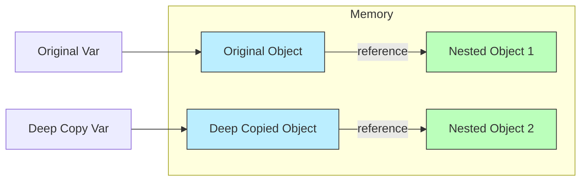

# Shallow Copy vs Deep Copy in JavaScript

Understanding how JavaScript handles data updating is crucial when working with objects and arrays. This guide explains the differences between Shallow Copy and Deep Copy.

## Primitive vs Reference Types

Before diving into copying, it's important to remember:
*   **Primitive types** (string, number, boolean, etc.) are passed by **value**.
*   **Reference types** (objects, arrays) are passed by **reference**.

## Shallow Copy

A **shallow copy** creates a new object, but it does not create copies of nested objects. Instead, it copies the *references* to those nested objects.

NOTE : A shallow copy duplicates the outer container while preserving references to all nested objects, causing shared mutable state across copies.

### Definition
*   Top-level properties are copied by value (if primitive).
*   Nested objects/arrays are copied by reference.
*   **Consequence**: Modifying a nested object in the copy **changes the original**.

### How to create a Shallow Copy
1.  `Object.assign()`
2.  Spread Operator `[...]` or `{...}`

### Example

```javascript
let original = {
  name: "Aditya",
  social: {
    twitter: "@aditya"
  }
};

let shallowCopy = { ...original };

shallowCopy.name = "Ashok"; // Does NOT affect original (Top-level primitive)
shallowCopy.social.twitter = "@newHandle"; // AFFECTS original (Nested reference)

console.log(original.name); // "Aditya"
console.log(original.social.twitter); // "@newHandle" - CHANGED!
```

### Visual Representation

```mermaid
graph LR
    subgraph Memory
        Obj1[Object: {name: "Aditya"}]
        Obj2[Object: {name: "Ashok"}]
        Nested[Shared Nested Object: {twitter: "@newHandle"}]
    end

    Original[Original Var] --> Obj1
    Copy[Shallow Copy Var] --> Obj2

    Obj1 -- reference --> Nested
    Obj2 -- reference --> Nested

    style Nested fill:#f9f,stroke:#333
```

> [!WARNING]
> Use shallow copies only when your object structure is flat (no nested objects) or when you specifically want shared state for nested items.

---

## Deep Copy

A **deep copy** creates a completely independent clone of the original object, including all nested objects.
NOTE : Deep copy recreates the entire object graph with no shared references, requiring recursive traversal and new allocations for every nested structure.

### Definition
*   recursively copies all properties.
*   New memory references are created for every nested object.
*   **Consequence**: Modifying the copy **never affects the original**.

### How to create a Deep Copy
1.  `JSON.parse(JSON.stringify(obj))` (Simple, but has limitations: no functions, symbols, or undefined).
2.  `structuredClone(obj)` (Modern standard).
3.  Lodash `_.cloneDeep(obj)` (External library).
4.  Recursive custom function.

### Example

```javascript
let original = {
  name: "Aditya",
  social: {
    twitter: "@aditya"
  }
};

let deepCopy = JSON.parse(JSON.stringify(original));

deepCopy.social.twitter = "@deepNew";

console.log(original.social.twitter); // "@aditya" - Unchanged!
console.log(deepCopy.social.twitter); // "@deepNew"
```

### Visual Representation



### Comparison Summary

| Feature | Shallow Copy | Deep Copy |
| :--- | :--- | :--- |
| **Top-level properties** | Copied | Copied |
| **Nested Objects** | Shared Reference | Independent Copy |
| **Memory Usage** | Low | High |
| **Speed** | Fast | Slow |
| **Methods** | `Object.assign`, spread | `JSON.parse/stringify`, `structuredClone` |

